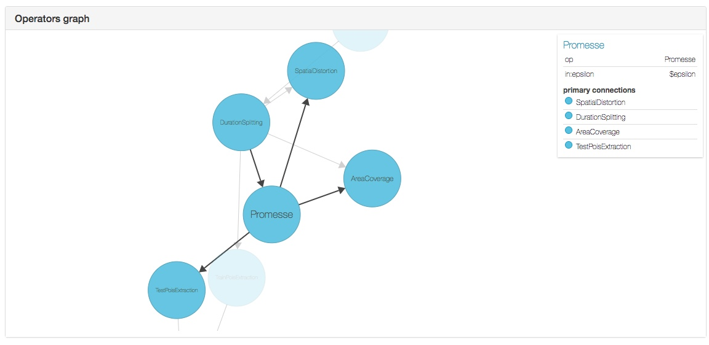

This page presents the concept of workflows, which are templates of experiments, and how to work with them.
The next section is about [how to instantiate a workflow](creating-runs.html), in order to actually execute it.

## Listing existing workflows
Workflows must be registered to a cluster before being instantiated.
They are shared among Accio users, which means that you should first start by verifying if there is not already a workflow defined for what you want to do.

Workflows are searchable with the [`accio get` command](commands/get.html):
```bash
accio get workflows
```

Like other objects, they can be filtered by owner, and the total number of results limited.
For example, to retrieve 5 workflows belonging to John Doe:
```bash
accio get workflows -owner=jdoe -n=5
```

Workflows can also be browsed and searched through the Web interface, accessible at the HTTP endpoint of the Accio gateway.


The advantage of the web interface is that you can have a graphical representation of an existing workflow, which is not possible through the command-line application.
Clicking on a node will display additional informations, such as its inputs and the nodes it is connected with.
This interface is very useful to understand a graph, especially it is large, or debug a graph that is not behaving as expected.



## Authoring a workflow

Operators are a system-level blocks: they need to be implemented by developers, who define their interface (i.e., their inputs and outputs).
You cannot add a new operator without coding it.

If you are a developer and want to create a custom operator, [there is a guide for that](../contribute/custom-operator.html)!
{: .note}

Fortunately, workflows can be defined by non-programmers thanks to the workflow definition language, which is based on [JSON](https://en.wikipedia.org/wiki/JSON).
Each workflow is described into its own file.
For example, the above example workflow could be modeled with the following definition:

```json
{
  "id": "geoind_workflow",
  "name": "Geo-indistinguishability workflow",
  "owner": "jdoe <john.doe@gmail.com>",
  "params": [
    {
      "name": "epsilon",
      "kind": "double",
      "default_value": 0.01
    },
    {
      "name": "uri",
      "kind": "string"
    }
  ],
  "graph": [
    {
      "op": "EventSource",
      "inputs": {
        "url": {"param": "uri"}
      }
    },
    {
      "op": "GeoIndistinguishability",
      "name": "Geo-I",
      "inputs": {
        "epsilon": {"param": "epsilon"},
        "data": {"reference": "EventSource/data"}
      }
    },
    {
      "op": "AreaCoverage",
      "inputs": {
        "level": {"value": 15},
        "train": {"reference": "EventSource/data"},
        "test": {"reference": "Geo-I/data"}
      }
    },
    {
      "op": "SpatialDistortion",
      "inputs": {
        "train": {"reference": "EventSource/data"},
        "test": {"reference": "Geo-I/data"}
      }
    }
  ]
}
```

We observe that this workflow has two parameters, `uri`, which is the URI to the source dataset and must be specified, and `epsilon`, which is the noise of the geo-indistinguishability algorithm and has a default value of 0.01.
Note that in the above example, the `Geo-I` node is renamed, although it was not necessary;
here it is only for conciseness (typing "GeoIndistinguishability" multiple times without doing any mistake is not an easy task!).

Only node inputs have to be specified, node outputs are automatically inferred from inputs.
Three manners of specifying inputs become apparent:

  * through a statically specified value, e.g., the `level` input port of the `Coverage` node;
  * through a parameter, e.g., the `url` input port of the `Source` node depends on the `uri` parameter;
  * through a reference to the output of another node, e.g., the `train` input port of the `Coverage` node depends on the `data` output of the `EventSource` node.
  References are specified with an absolute name, formed of a node name and an output name, separated by a slash, e.g., `Geo-I/data`.
  * through its default value.
  The input's default value is only used if:
    * if nothing is specified in the workflow concerning this input; or
    * if the input is associated with a parameter that
      1. does not have a default value, and
      2. is associated only with inputs having a default value, and
      3. is not specified by the user at run time.

If both a parameter and an input have default values, the parameter's default value will be used.

Each workflow has a unique identifier, the `id` field in the definition language.
This identifier is very important because it will have to be specified later when creating runs.
By default, it falls back to the name of the file inside which the workflow is defined (without its extension).

The reference section contains [the specification of the workflow definition language](workflow-dsl.html).
{: .note}

## Publishing a workflow
Once you have written your new workflow, or created a new version of an existing workflow, you need to make it available to the Accio cluster.
This is done with the [`accio push` command](commands/push.html):
```bash
accio push path/to/my/workflow.json
```

If the workflow definition was invalid, the workflow will not be created (or updated) and you will be given information about what was wrong.

If you push a workflow which already exists (based on the `id` field), a new version of it will be created.
It means that you have to be very careful not overriding an existing workflow by mistake.

Each time a workflow is pushed, a version number is automatically assigned to it by Accio.
Versioning workflows allows past runs to reference workflows at previous versions.
It is useful to examine the workflows that was actually executed, even if it has been updated in-between.
For the same reason, it is not possible to delete a workflow that has some runs associated to it.
